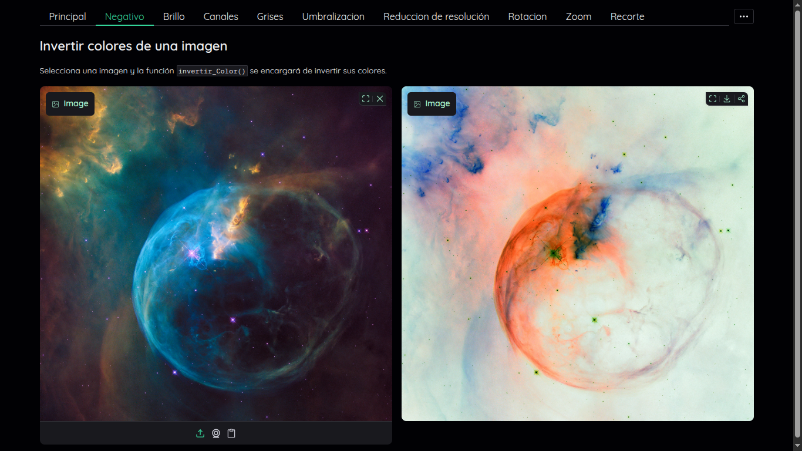
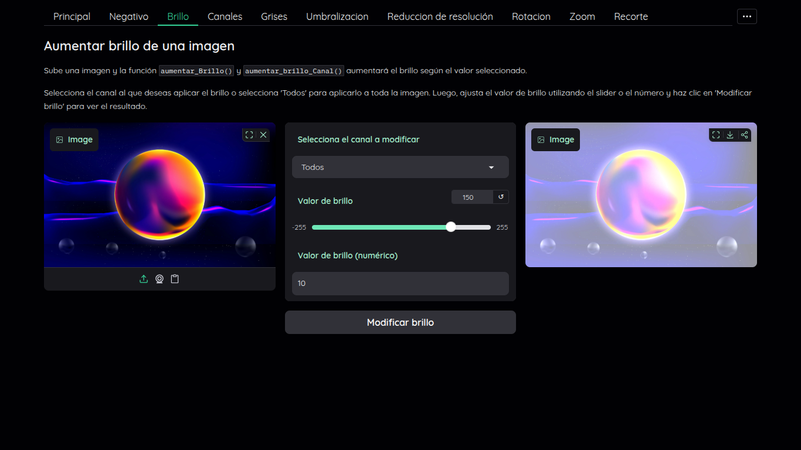
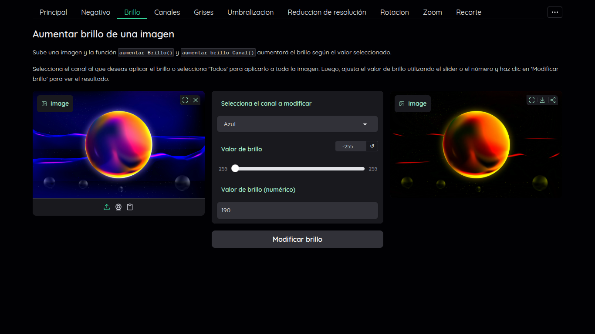
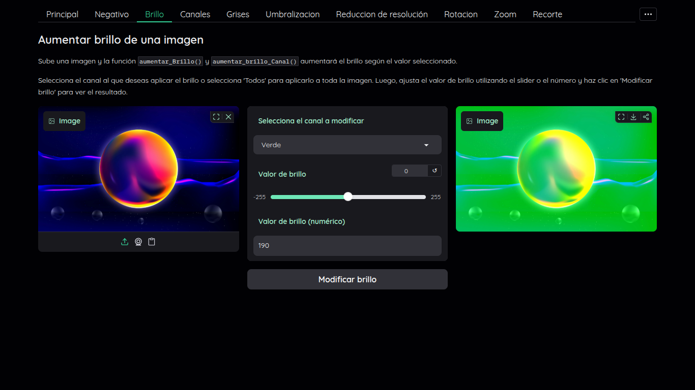
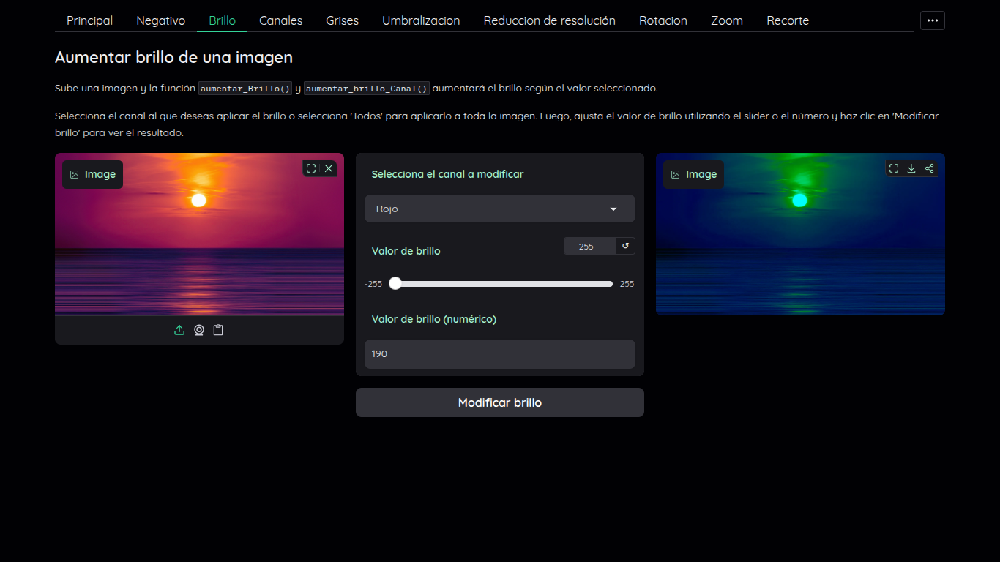
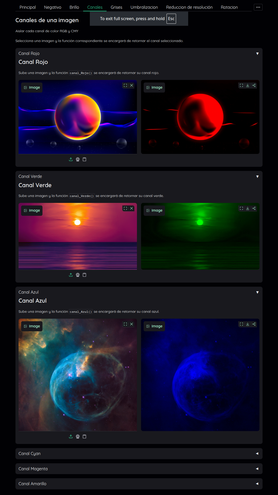

# Procesamiento de imágenes con Numpy
### En esta interfaz, puedes subir una imagen y aplicar diferentes transformaciones utilizando las funciones creadas en la librería `libreria.py`.

### Selecciona la pestaña para aplicar la transformación deseada a tu imagen.
## Funciones disponibles:
- **Negativo**: Invierte los colores de la imagen. 
- **Brillo y Brillo por canal**: Aumenta o disminuye el brillo de la imagen según el valor seleccionado.    
- **Canales**: Permite visualizar los diferentes canales de la imagen **_(Rojo, Verde, Azul, Cyan, Magenta, Amarillo)._**
- **Escala de grises**: Convierte la imagen a escala de grises utilizando diferentes tecnicas **_(Average, Luminosity, MidGray):_**.
- **Umbralización**: Binariza la imagen según un valor de umbral seleccionado.
- **Reducción de resolución**: Reduce la resolución de la imagen por un factor dado.
- **Rotación**: Rota la imagen según un ángulo seleccionado.
- **Zoom**: Recorta y amplia la imagen según un factor seleccionado.
- **Recorte**: Recorta la imagen según las coordenadas dadas.
- **Suma de imágenes**: Permite sumar dos imágenes pixel a pixel, con un factor de mezcla opcional (alpha) para ponderar la suma.
- **Histograma**: Muestra el histograma de la imagen para el canal seleccionado. 

## Negativo

### Invierte los colores de una imagen

Selecciona una imagen y la función `invertir_Color(ruta)` se encargará de invertir sus colores.

## Brillo

### Aumentar brillo de una imagen

Sube una imagen y la función `aumentar_Brillo(ruta, valor)` y `aumentar_brillo_Canal(ruta, valor, canal)` aumentará el brillo según el valor seleccionado.

Selecciona el canal al que deseas aplicar el brillo o selecciona 'Todos' para aplicarlo a toda la imagen.

Luego, ajusta el valor de brillo utilizando el slider o el número y haz clic en 'Modificar brillo' para ver el resultado.

#### Brillo global por slider

#### Modificacion del canal azul por slider

#### Modificacion del canal verde por numero

#### Modificacion del canal rojo por slider

## Canales

### Visualizar canales de una imagen

Aislar cada canal de color RGB y CMY de una imagen para su visualización.

Selecciona una imagen y la función correspondiente se encargará de retornar el canal seleccionado. `canal_Rojo(ruta) , canal_Verde(ruta) , canal_Azul(ruta)` 

#### Canales RGB

#### Canales CMY
 ![[CMY.png]]

# Grises

### Conversión a escala de grises

Sedlecciona una imagen y selecciona metodo, luego las funciones `gris_Average(ruta)`, `gris_Luminosity(ruta)` o `gris_MidGray(ruta)` convertirán la imagen a escala de grises según el método seleccionado.

#### Gris Average 

![[grisA.png]]

#### Gris Luminosity
![[grisL.png]]

#### Gris MidGray
![[grisM.png]]

# Umbralizacion

## Binarizacion de una imagen

Sube una imagen y la función `binarizar(ruta, umbral)` se encargará de umbralizar la imagen según el valor seleccionado.
*El umbral es un valor entre \[0,256]*
#### Binarizacion por slider 

![[binarizacion_slider.png]]

#### Binarizacion por numero 

![[binarizacion_num.png]]

#### Reduccion de resolucion

### Reducción de resolución de una imagen
"Sube una imagen y la función `reducir_Resolucion(ruta, factor)` se encargará de reducir su resolución según el factor seleccionado.

*El factor es un valor entre \[1,10]*

![[redu_reso.png]]
#### Resultado
![[redu_resu.png]]

# Rotacion

### Rotación de una imagen

Sube una imagen y la función `rotar` se encargará de rotarla según el ángulo seleccionado.

*Esta es la unica funcion no implementada en la libreria*
![[rotacion.png]]

![[rot270.png]]

# Zoom

### Zoom de una imagen

Sube una imagen y la función `zoom(ruta, zoom, zoom_factor)` se encargará de hacer zoom según el factor seleccionado.

*Donde **zoom** es el tamaño del cuadrado recortado del centro, y  **zoom_factor** es la intensidad del efecto zoom (entre \[1,10])*

![[Zoom.png]]

![[zoom_resu.png]]

# Recorte

### Recorta una imagen

"Sube una imagen y la función `recorte(ruta, xini, xfin, yini, yfin)` se encargará de recortarla según las coordenadas seleccionadas." 

![[recor.png]]

![[recor_resu.png]]

# Suma de imágenes

### Suma dos imágenes

"Sube dos imágenes y la función `sumar_Imagenes1(ruta1, ruta2)` se encargará de sumarlas pixel a pixel."

La imagen Fondo tiene una resolucion de *1920x1080* la imagen superposicion tiene una resolucion de *1280x720* y las dos están en formato *PNG*
![[suma.png]]
![[suma_resu1.png]]

La imagen Fondo tiene una resolucion de *1920x1080* la imagen superposicion tiene una resolucion de *1280x720* y las dos están en formato *JPG*
![[suma2.png]]
![[suma_resu2.png]]

# Histograma

### Histograma de una imagen
Sube una imagen y la función `histograma(ruta, canal)` se encargará de mostrar su histograma.

![[histor.png]]![[histoA.png]]
![[histoV.png]]
